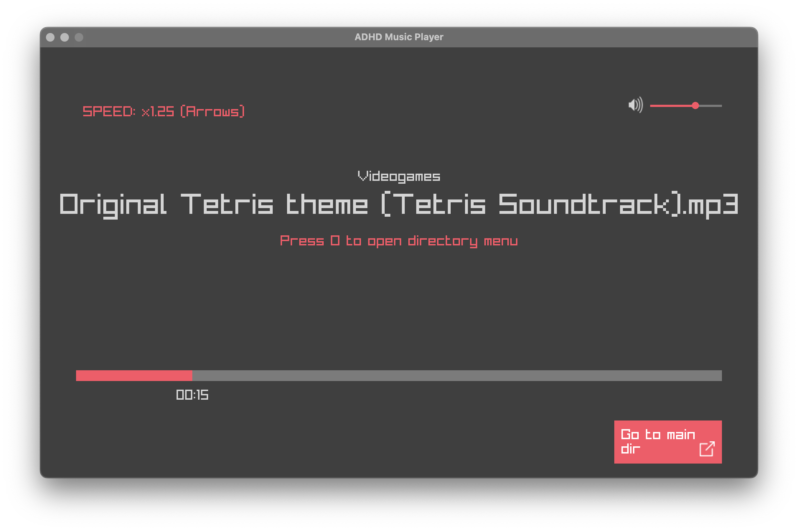

# MusicPlayer

This project was made with the excuse of learning simple GUI implementation using Raylib in C. It is a simple audio player which will loop through the .mp3 files in a directory, with the option of changing said directory to another one on the same level via a built-in "directory explorer".
 
The App is designed and built for MacOSX, but it might work on some Linux distros depending on the environment.

## Use
First, change the values for `PATH` and `STARTING_DIR` in the config/config.h file to the general directory path, which contains the smaller directories with the songs, and the name of the starting directory. Have in mins that the two will be concatenated to reproduce the songs, so be careful with the use of the `/` symbol.

No error example:
``` C
#define PATH "/Users/myname/Music/"
#define STARTING_DIR "Classical"
```
The the `/` will concatenate, so the full path will be "/Users/myname/Music/Classical", resulting in no errors.

Error example:
``` C
#define PATH "/Users/myname/Music/"
#define STARTING_DIR "/Classical"
```
The the `\` will concatenate, so the full path will be "/Users/myname/Music//Classical", resulting in an error not finding the desired song.

You can pause the song, change its speed, volume and skip/go back to other songs in the directory.
### Controls
- Change Speed: Up/Down Arrows.
- Next/Previous song: Right/Left Arrows.
- Pause/Resume: Space bar.
- Change directory: O Key.

## Installation

### Dependencies
- GCC/Clang
- Raylib

### MacOS (Apple Silicon)
Once the project its downloaded, execute the following command in the root directory:
```
make build_osx
```
To run, execute:
```
make run
```
If you wish to do both simultaniously:
```
make build_n_run
```

### MacOS (Intel)
You will need to download and create the archive file "libraylib.a", and substitute the one you will find in the lib/ directory with the one you just created, then proceed as with the Silicon version described above.

### Linux
As with the Intel chips, delete the libraylib.a file in the lib/ folder and replace it with the appropiate one for your OS (you will need to download it from the Raylib GitHub. Then, proceed exactly like is described in the Apple Silicon instructions.

## Customization
To change certain aspects and functionallities of the App, you will need to edit the config/config.h header file to the desired values.

### Yet to come
In the future, you will be able to:
- Change the color and opacity of the background (currently is black and transparent).
- Change the font, font size and font color.
- Change the size and color of the icons.
